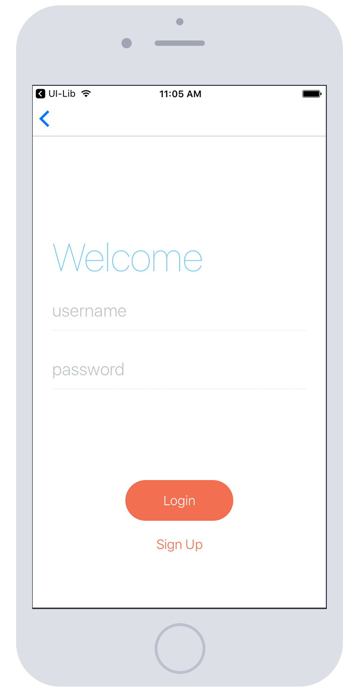

import UILivePreview from '@site/src/components/UILivePreview';

Here's a simple demonstration showcasing our core components, modifiers, and presets working together to create an elegant UI screen.  
For comprehensive documentation, explore our guides on [Style](../foundation/style.md), [Modifiers](../foundation/modifiers.md), and individual Components.

<!-- . -->

<UILivePreview code={`function Example(props) {
    return (
      

        <View flex center>
          <Text blue50 text20 marginB-s5>
            Welcome
          </Text>
          <SegmentedControl segments={[{label: 'Register'}, {label: 'Login'}]}/>
          <View marginT-s5>
            <TextField preset="outline" placeholder="username" />
            <TextField preset="outline" placeholder="password" secureTextEntry grey10 />
          </View>
          <View row marginT-s5 centerV>
            <Button link text70 orange30 label="Sign Up" marginR-s5 />
            <Button text70 white background-orange30 label="Login" />
          </View>
        </View>
      

    );
}`}/>
