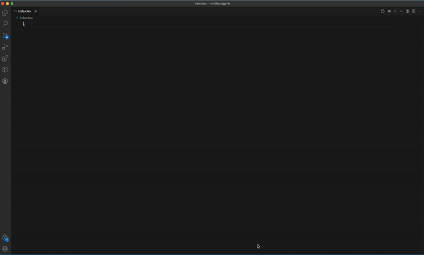

# rnuilib-snippets

This extension provides code snippets for `react-native-ui-lib`'s components for Vs Code editor.
It supports JavaScript and TypeScript, ReactJavaScript and ReactTypeScript.

## How to use

After installing this extension you can generate a code snippet by simply typing a component's name (camelCase) and see the option in the suggestion tooltip.
Using the tab key you can navigate through the fields to enter your values.

Also, type `rnuilib` and get the uilib import - `import {} from 'react-native-ui-lib'` - to import the components.

See video:

## Requirements

This extension generate code for `react-native-ui-lib`'s components. `react-native-ui-lib` should be installed as a dependency to your projects. See: https://github.com/wix/react-native-ui-lib#installing

**Enjoy!**
